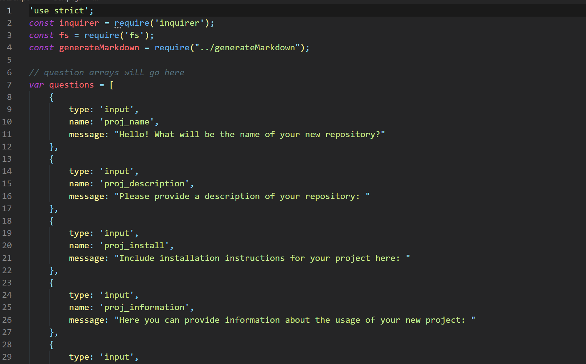
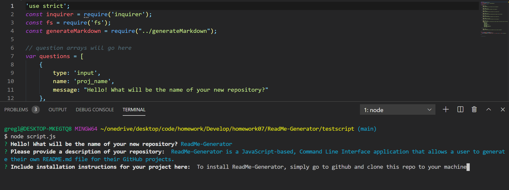
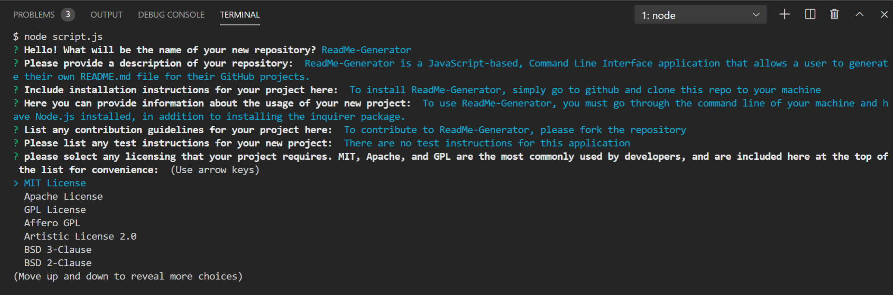
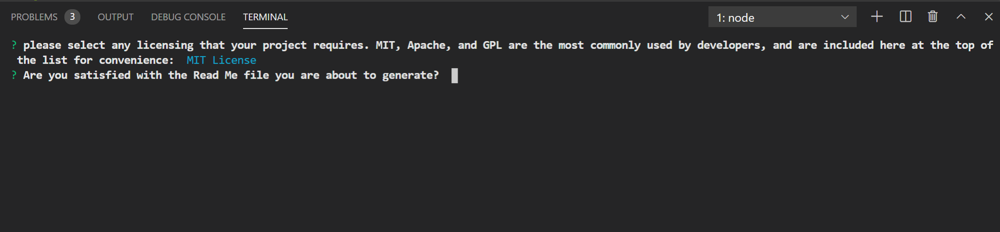
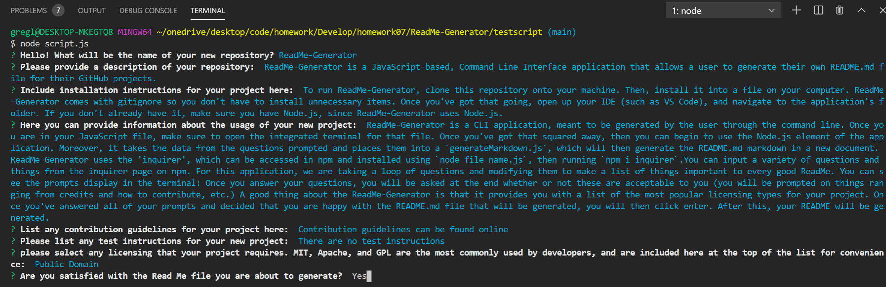
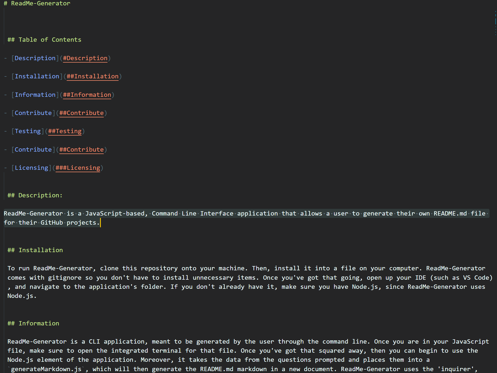

# ReadMe-Generator

## Description

A GitHub profile is an extremely important aspect of a developer's public identity. You can show off your work to other developers, thus becoming an active part of a dynamic and fluid community. Most importantly, a good README.md file can be seen by potential employers! 

The quality of a README often differentiates a good project from a bad project. A good one takes advantage of the opportunity to explain and showcase what your application does, justify the technologies used, and even talk about some of the challenges you faced and features you hope to implement in the future. A good README helps you stand out among the large crowd of developers putting their work on GitHub.

At a minimum, your project README needs a title and a short description explaining the what, why, and how. What was your motivation? Why did you build this project? (Note: The answer is not "Because it was a homework assignment.") What problem does it solve? What did you learn? What makes your project stand out? 

With this in mind, ReadMe-Generator is an application developed using pure JavaScript and Node.js. The application will prompt the user with a series of questions that are important for any GitHub repository, including a description, table of contents, licensing information, instructions for use, ways to contribute, and ways to test out the application.

## Table of Contents for ReadMe-Generator

- [Description](#Description)

- [Installation](##Installation)

- [Information](##Information)

- [Contribute](##Contribute)

- [Testing](##Testing)

- [Contribute](##Contribute)

- [Licensing](###Licensing)

## Installation

To run ReadMe-Generator, clone this repository onto your machine. Then, install it into a file on your computer. ReadMe-Generator comes with gitignore so you don't have to install unnecessary items. Once you've got that going, open up your IDE (such as VS Code), and navigate to the application's folder. If you don't already have it, make sure you have Node.js, since ReadMe-Generator uses Node.js.

## Usage 

ReadMe-Generator is a CLI application, meant to be generated by the user through the command line. Once you are in your JavaScript file, make sure to open the integrated terminal for that file. Once you've got that squared away, then you can begin to use the Node.js element of the application. Moreover, it takes the data from the questions prompted and places them into a `generateMarkdown.js`, which will then generate the README.md markdown in a new document. ReadMe-Generator uses the 'inquirer', which can be accessed in npm and installed using `node file name.js`, then running `npm i inquirer`. Once you've done this, you will be able to call inquirer in your JavaScript file, like so: 

You can input a variety of questions and things from the inquirer page on npm. For this application, we are taking a loop of questions and modifying them to make a list of things important to every good ReadMe. You can see the prompts display in the terminal: 

Once you answer your questions, you will be asked at the end whether or not these are acceptable to you (you will be prompted on things ranging from credits and how to contribute, etc.) A good thing about the ReadMe-Generator is that it provides you with a list of the most popular licensing types for your project, pictured below: 

Once you've answered all of your prompts and decided that you are happy with the README.md file that will be generated, you will then click enter. After this, your README will be generated, like so:

## Credits

For this application, I was helped immensely by my colleagues in the University of Pennsylvania LPS Coding bootcamp, especially Brandon Grayson (https://github.com/BrandonGrayson), Dmitri So (https://github.com/dmitriso), Leif Hetland (https://github.com/leifehetland) and Vince Gubitosi (https://github.com/gubitosi). 

I also used the library for inquirer, available at the github page of Simon Boudrias (https://github.com/SBoudrias).

## License

The last section of a good README is a license. This lets other developers know what they can and cannot do with your project. If you need help choosing a license, use [https://choosealicense.com/](https://choosealicense.com/)

## Contributing

## Enforcement Guidelines

Community leaders will follow these Community Impact Guidelines in determining
the consequences for any action they deem in violation of this Code of Conduct:

### 1. Correction

**Community Impact**: Use of inappropriate language or other behavior deemed
unprofessional or unwelcome in the community.

**Consequence**: A private, written warning from community leaders, providing
clarity around the nature of the violation and an explanation of why the
behavior was inappropriate. A public apology may be requested.

### 2. Warning

**Community Impact**: A violation through a single incident or series
of actions.

**Consequence**: A warning with consequences for continued behavior. No
interaction with the people involved, including unsolicited interaction with
those enforcing the Code of Conduct, for a specified period of time. This
includes avoiding interactions in community spaces as well as external channels
like social media. Violating these terms may lead to a temporary or
permanent ban.

### 3. Temporary Ban

**Community Impact**: A serious violation of community standards, including
sustained inappropriate behavior.

**Consequence**: A temporary ban from any sort of interaction or public
communication with the community for a specified period of time. No public or
private interaction with the people involved, including unsolicited interaction
with those enforcing the Code of Conduct, is allowed during this period.
Violating these terms may lead to a permanent ban.

### 4. Permanent Ban

**Community Impact**: Demonstrating a pattern of violation of community
standards, including sustained inappropriate behavior,  harassment of an
individual, or aggression toward or disparagement of classes of individuals.

**Consequence**: A permanent ban from any sort of public interaction within
the community.

## Attribution

This Code of Conduct is adapted from the [Contributor Covenant][homepage],
version 2.0, available at
[https://www.contributor-covenant.org/version/2/0/code_of_conduct.html][v2.0].

Community Impact Guidelines were inspired by 
[Mozilla's code of conduct enforcement ladder][Mozilla CoC].

